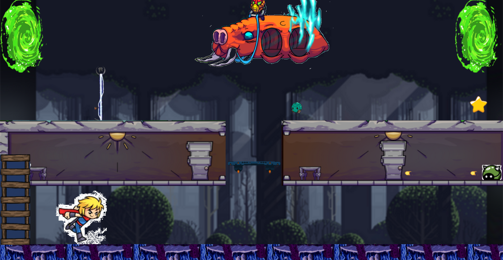

# Mario-Like Game in C#



## Description

This project is a Mario-like game developed in C#. The player navigates through various levels, avoiding obstacles and enemies, to reach the end goal.

## Features

- **Platformer Gameplay:** Classic platforming mechanics with jumping, climbing, and moving platforms.
- **Enemies and Obstacles:** Various enemies and obstacles to avoid.
- **Animated Characters:** Animated sprites for the main character and enemies.
- **Multiple Levels:** Different levels with unique designs and challenges.
- **Smooth Controls:** Responsive controls for an enjoyable gaming experience.

## Technical Details

- **Language:** C#
- **Framework:** .NET
- **Libraries:** System.Drawing, System.Windows.Forms
- **IDE:** Visual Studio

## Getting Started

### Prerequisites

- Visual Studio or any other C# IDE
- .NET Framework

### Installation

1. **Clone the repository:**
    ```bash
    git clone https://github.com/zakaria409/mario-like-game.git
    ```
2. **Open the project in Visual Studio.**
3. **Build the project.**
4. **Run the game.**

## Code Overview

The main code for the game is in `Form1.cs`, which handles game initialization, rendering, and input processing.

```csharp
public partial class Form1 : Form
{
    // Initialize game objects, load assets, and set up game loop
    public Form1()
    {
        InitializeComponent();
        // Load assets and initialize game objects
    }

    // Handle key press events for player movement and actions
    private void Form1_KeyDown(object sender, KeyEventArgs e)
    {
        // Handle player input
    }

    // Handle key release events
    private void Form1_KeyUp(object sender, KeyEventArgs e)
    {
        // Handle key release
    }

    // Game loop: update game state and render
    private void T_Tick(object sender, EventArgs e)
    {
        // Update game state
        // Render game
    }

    // Double buffering to reduce flickering
    void Drawdoublebuffer(Graphics g)
    {
        Graphics g2 = Graphics.FromImage(bitmap);
        Drawscene(g2);
        g.DrawImage(bitmap, 0, 0);
    }

    // Render game objects
    void Drawscene(Graphics g)
    {
        // Clear screen, draw background, draw game objects
    }
}
